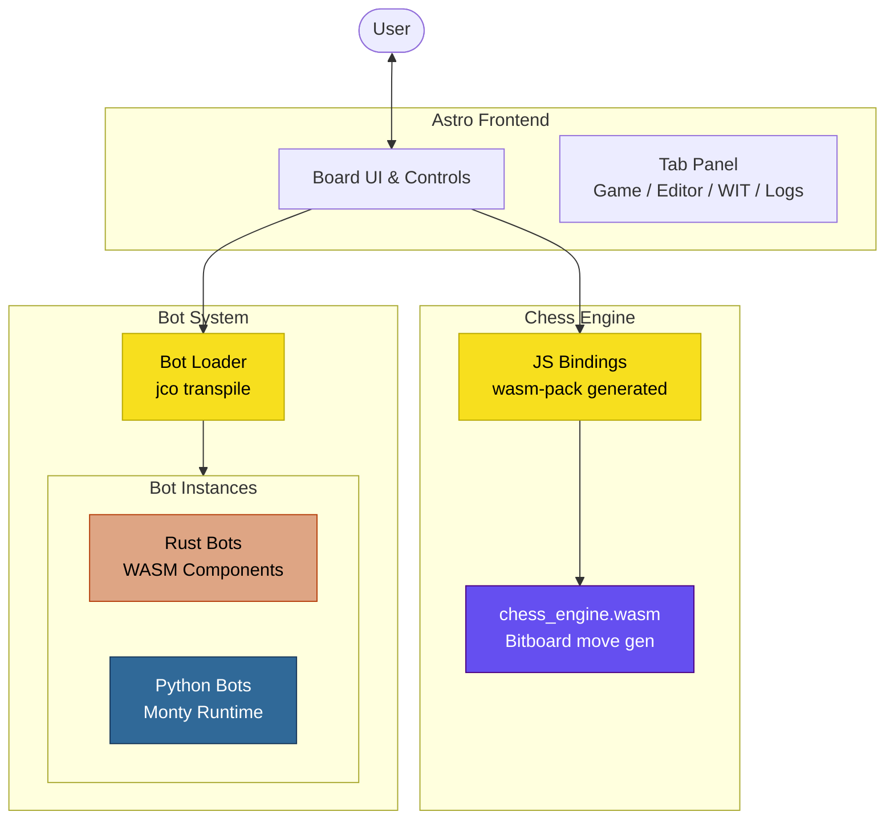

# WASM Chess

A chess engine written in Rust (bitboard-based, 97 tests, PERFT-verified) compiled to WebAssembly, with a plugin system for AI bots using the WASM Component Model and WIT interfaces. Bots can be written in Rust and compiled to WASM components, or written in Python and interpreted at runtime via the Monty WASM runtime.



## Quick Start

```bash
nix develop
cd site && npm install && npm run dev
```

Build everything from scratch:

```bash
nix develop

# Chess engine
wasm-pack build chess-engine --target web --release

# Bots (Rust → WASM Component → JS)
cargo component build --manifest-path bots/smart-bot/Cargo.toml --release
cargo component build --manifest-path bots/random-bot/Cargo.toml --release

# Site
cd site && npm run build
```

## Documentation

### Project-Specific
- **[Architecture](docs/architecture.md)** -- Mermaid diagrams covering system overview, build pipelines, runtime move flow, WIT component boundaries, and bot loading lifecycle
- **[Bot Interface (WIT)](wit/chess-bot/bot.wit)** -- the `chess:bot@0.1.0` interface that bots implement
- **[Engine Interface (WIT)](wit/chess-engine/engine.wit)** -- the `chess:engine@0.1.0` resource API
- **[Shared Types (WIT)](wit/chess-types/types.wit)** -- `chess:types@0.1.0` used across both interfaces

### General Knowledge
General architectural patterns and WASM Component Model concepts from this project have been migrated to the [knowledge vault](https://github.com/sammasak/knowledge-vault) for broader reuse:
- **WASM Component Model Browser Plugin Architecture** - Runtime plugin loading patterns, jco transpile workflow, host-mediated instantiation

## Testing

```bash
nix develop -c cargo test --manifest-path chess-engine/Cargo.toml   # 97 tests
nix develop -c cargo test --manifest-path bots/smart-bot/Cargo.toml # 16 tests
cd site && npx playwright test                                       # 10 E2E tests
```

## Tech Stack

| Layer | Technology |
|-------|-----------|
| Engine | Rust, bitboards, wasm-pack |
| Bot plugins | WASM Component Model, WIT, cargo-component, jco |
| Python bots | [Monty](https://github.com/pydantic/monty) (Python subset in WASM) |
| Frontend | Astro, CodeMirror 6 |
| Testing | cargo test, Playwright |
