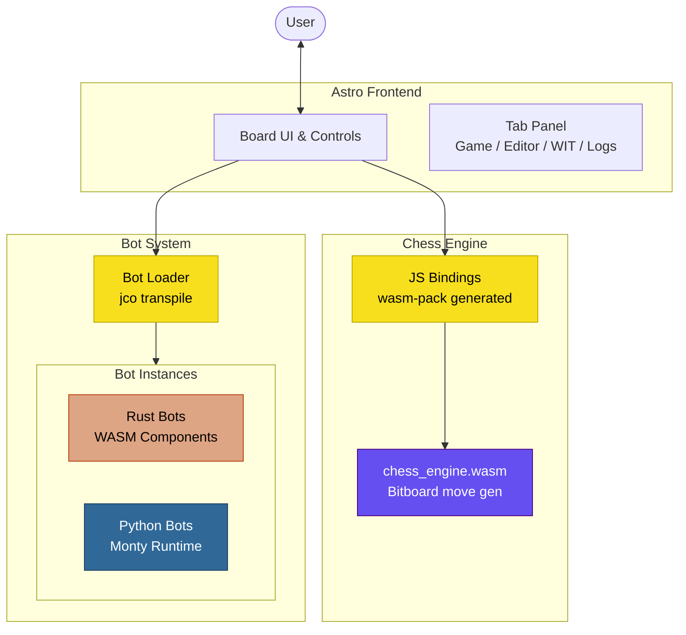
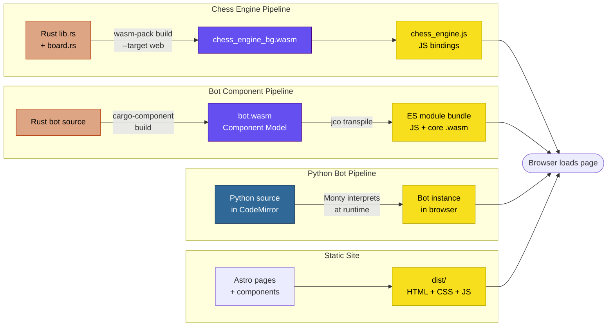
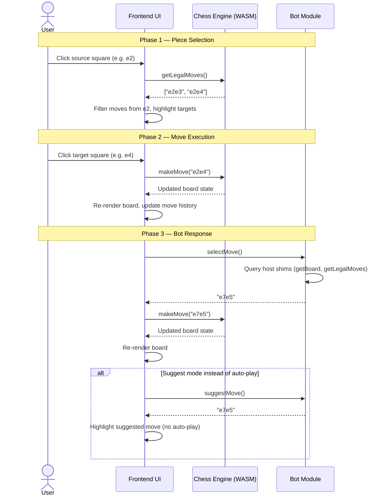
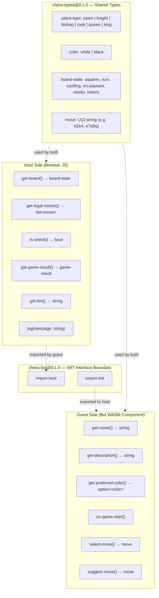
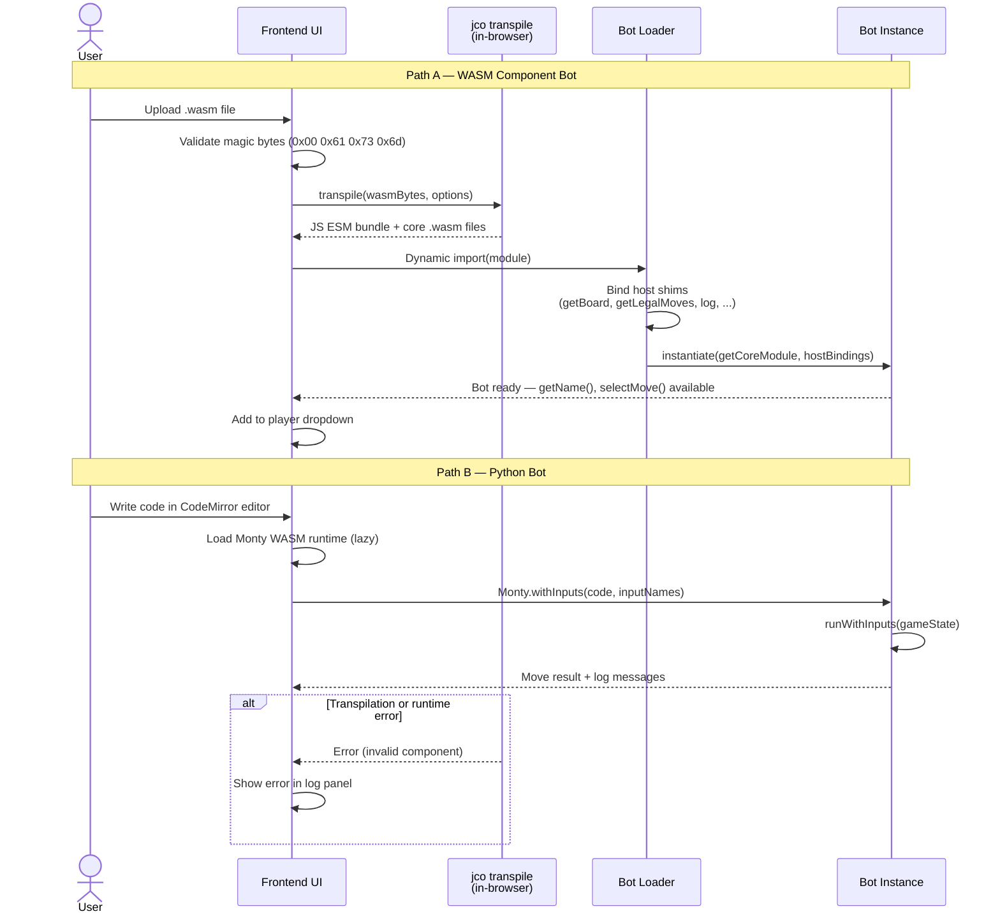
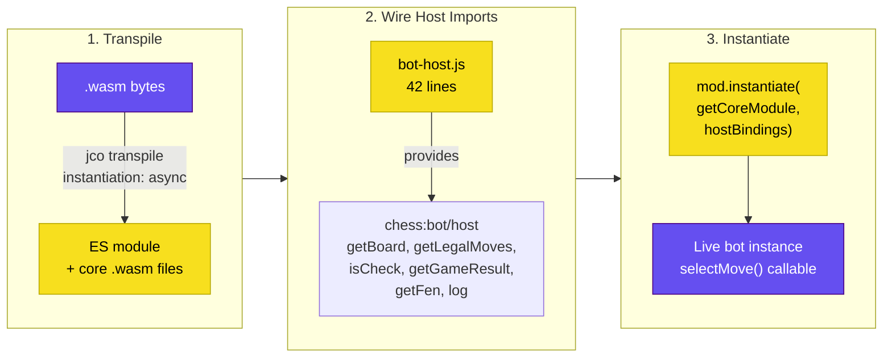

# Architecture

This document describes the architecture of the WASM Chess project: a chess engine written in Rust, compiled to WebAssembly, with a plugin system for AI bots using the WASM Component Model.

## System Overview

All major components and how they connect.



## Build Pipelines

Three distinct pipelines produce browser-loadable artifacts from source code.



## Runtime Move Flow

The sequence of events from a user clicking a square through the engine processing to the bot responding.



## WIT Component Model Boundaries

The WIT interface contract defines what the host provides and what the guest (bot) implements. This is the API for anyone writing a new bot.



## Bot Loading Lifecycle

How a bot goes from a `.wasm` file (or Python source) to a running, callable instance in the browser.



## Plugin System: Host-Mediated Component Instantiation

The bot upload system is a runtime plugin architecture built on the WASM Component Model. This section explains why this design works, what the alternatives are, and how the pieces fit together.

### Why not compose components at build time?

The WASM Component Model ecosystem offers two composition strategies:

| Strategy | Tool | When | Tradeoff |
|----------|------|------|----------|
| **Build-time** | WAC (WebAssembly Composition) | Before deployment | Single binary, nanosecond calls between components, but all plugins must be known ahead of time |
| **Runtime** | Host-mediated instantiation | At page load or user upload | Plugins can be added dynamically, but the host must bridge component imports |

Build-time composition (WAC, or the deprecated `wasm-tools compose`) merges multiple components into a single binary where cross-component calls are direct function calls. This is ideal for server-side systems where all components are known at deploy time, but it cannot support user-uploaded plugins.

For an interactive system where users upload arbitrary `.wasm` bots, we need runtime instantiation — and in the browser, the JavaScript host IS the runtime.

### The jco transpile + instantiate pattern

When a user uploads a `.wasm` bot component, the system performs three steps:



**Step 1: Transpile.** `jco transpile` converts a WASM Component into browser-loadable ES modules. The `instantiation: { tag: 'async' }` option produces a factory function (`mod.instantiate(...)`) instead of auto-instantiating — this is what allows us to provide imports at runtime rather than through static ES module imports.

**Step 2: Wire host imports.** The WIT contract (`chess:bot@0.1.0`) declares that bots import a `host` interface. In the browser, `bot-host.js` implements this interface by delegating to the chess engine's WASM resource methods. This 42-line file is the entire bridge between engine and bot:

```
bot calls getBoard()  →  bot-host.js  →  game.getBoardState()  →  chess engine WASM
bot calls log(msg)    →  bot-host.js  →  logCallback(msg)      →  UI log panel
```

**Step 3: Instantiate.** The transpiled module's `instantiate()` function takes two arguments: a core module loader (resolves `.wasm` files from blob URLs) and the host import bindings. After instantiation, the bot's exported functions (`selectMove`, `getName`, etc.) are callable JavaScript functions.

### This IS the officially intended pattern

The JavaScript host providing imports to a WASM component is not a workaround — it is architecturally equivalent to how native WASM runtimes work:

| Environment | Host | How imports are provided |
|-------------|------|--------------------------|
| **Wasmtime** (Rust) | `wasmtime::component::Linker` | `linker.func_wrap("chess:bot/host", "get-board", \|\| { ... })` |
| **Browser** (this project) | `bot-host.js` + `mod.instantiate()` | `{ 'chess:bot/host': { getBoard: () => game.getBoardState() } }` |

In both cases, the host runtime satisfies the component's declared imports. The WIT file is the contract; the host implementation is interchangeable.

### WIT as the plugin contract

The entire plugin system rests on a single WIT definition. Any language that compiles to a WASM Component can implement it:

```
world chess-bot {
    import host;        // ← host provides: get-board, get-legal-moves, log, ...
    export bot;         // ← guest implements: get-name, select-move, suggest-move, ...
}
```

This means:
- **Rust bots** compile with `cargo-component build`, producing a `.wasm` Component directly
- **Any language** with Component Model tooling (C, Go, JavaScript via ComponentizeJS, etc.) can produce a compatible `.wasm`
- **Python bots** bypass the Component Model entirely — Monty interprets Python at runtime and calls the engine directly, implementing the same logical interface in JavaScript

### Pre-built vs uploaded bots

The system handles two bot deployment modes that use different jco transpile settings:

| | Pre-built bots | Uploaded bots |
|---|---|---|
| **When transpiled** | At build time (CI/development) | At runtime (in browser) |
| **jco mode** | Default (auto-instantiate) | `instantiation: { tag: 'async' }` |
| **Import resolution** | Static ES module imports from `bot-host.js` | Host bindings passed to `instantiate()` |
| **Core .wasm loading** | Static file paths | Blob URLs from transpile output |
| **Result** | `import { bot } from './smart_bot_component.js'` | `const { bot } = await mod.instantiate(getCoreModule, bindings)` |

Both paths end at the same place: a bot object with `getName()`, `selectMove()`, and `suggestMove()` methods. The abstraction in `loadBot()` (`bot-manager.js`) unifies these behind a common interface.

### Why jco transpile is required (for now)

Browsers cannot execute Component Model `.wasm` files directly. A Component is not a core wasm module — it bundles multiple core modules, canonical ABI metadata, and typed interface declarations. `WebAssembly.compile()` only understands core wasm. jco transpile bridges this gap by extracting the core `.wasm` modules and generating JS glue that implements the Component Model's canonical ABI.

This is not a workaround. Luke Wagner (Component Model spec author) describes jco as ["a fantastic polyfill"](https://github.com/WebAssembly/component-model/issues/316) and the Bytecode Alliance [lists jco as the official way](https://component-model.bytecodealliance.org/) to run components in JavaScript environments.

**When will browsers support components natively?** Not soon. The Component Model is at [Phase 1](https://github.com/WebAssembly/proposals) (Feature Proposal) in the W3C process — it must reach Phase 4 before browsers implement it. Luke Wagner [noted](https://github.com/WebAssembly/component-model/issues/316) that browsers are focused on higher-priority features (wasm-gc, shared-everything-threads, stack-switching) that are harder to polyfill, and that native Component Model support is lower priority precisely because jco exists. No browser vendor has published an implementation timeline.

The related [ESM Integration proposal](https://github.com/WebAssembly/esm-integration) (Phase 3) covers core wasm modules only. The Component Model has [its own ESM extension](https://github.com/WebAssembly/esm-integration/blob/main/proposals/esm-integration/README.md) that depends on the Component Model itself advancing — so even when `import { foo } from './module.wasm'` works for core modules, it won't handle components.

**Implication for this project:** jco transpile (whether at build time for pre-built bots or at runtime for uploaded bots) will remain a required step for the foreseeable future (at least through 2027, given WASI 1.0 is projected for late 2026/early 2027 and browser implementation would follow). The project's architecture is aligned with the Bytecode Alliance's recommended approach and will transition naturally when native support arrives — the WIT contracts and component binaries stay the same, only the JS glue layer goes away.
